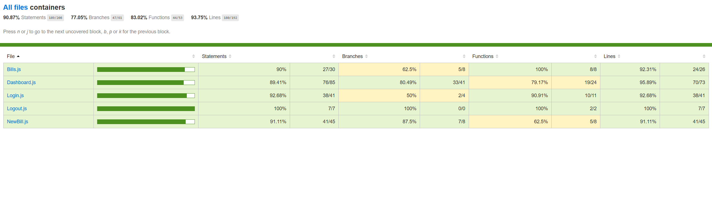
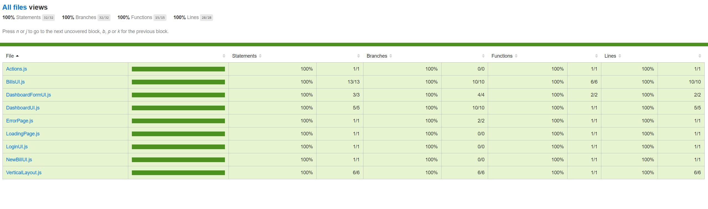

# Débuggez et testez un SaaS RH - P9 OpenClassrooms

Ce repository Github contient les projet Back-End et Front-End;

Un plan de tests End-To-End pour le parcours employé est également présent, il s'agit du document au format PDF "Billed - E2E parcours employee.pdf"

Le résultat du coverage est disponible dans le projet Front-End, dans le répertoire `./Billed-app-FR-Front/coverage/lcov-report/`

Taux de coverage obtenu sur la partie containers :

Taux de coverage obtenu sur la partie views :
